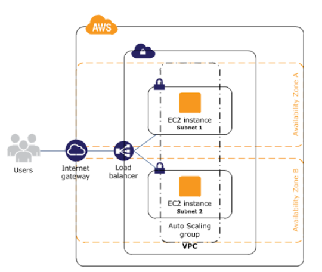

# Servian DevOps Tech Challenge - Tech Challenge App

TABLE OF CONTENTS:

1. [High level design diagram](#1-high-level-design-diagram)

2. [How to deploy](#4-how-to-deploy)

    - [Dependencies](#dependencies)
    - [AWS account authentication](#aws-account-authentication)
    - [Manually create an S3 bucket in your AWS account](#manually-create-an-s3-bucket-in-your-aws-account)
    - [Configure Terraform backend and variables](#configure-terraform-backend-and-variables)
    - [Run Terraform](#run-terraform)
    - [Delete the stack](#delete-the-stack)

3. [Future work](#3-future-work)

## 1. High level design diagram

The deployment will create 2 types of subnets (private and public) across all 3 availability zones for the ap-southeast-2 region in AWS.\
3 public subnets for the load balancer and internet access for the NAT gateway and 3 private subnets to run the virtual machines and postgres database.\
The virtual machines are scaled in using an auto scale group and the [install.sh](terraform/install.sh) script runs the initial setup of the server when instances are spin up.

*The above diagram represents a high available solution (tasks and database deployed in multiple subnets). For demonstration and learning purposes, the implementation is fixed to deploy a single replica for the database.* 

*source:(https://techiekaustubh.medium.com/designing-high-availability-systems-in-aws-cloud-8134d7303764)*

---

## 2. How to deploy

### Dependencies
- [Terraform](https://www.terraform.io/)
- AWS account
- [AWS CLI](https://aws.amazon.com/cli/)

### AWS account authentication

To run below commands, you will need to make sure to be authenticated to an AWS account.
That can be done either exporting an AWS IAM User key/secret or by using roles if you have that setup.

[Configure AWS cli credentials](https://docs.aws.amazon.com/cli/latest/userguide/cli-configure-files.html#cli-configure-files-where)

### Manually create an S3 bucket in your AWS account
No extra configuration is needed, ensure AWS credentials give access to the S3 bucket.

[Create a S3 Bucket](https://docs.aws.amazon.com/AmazonS3/latest/userguide/creating-bucket.html)

### Configure Terraform backend and variables

Before running the Terraform commands, you will need to make sure that the following variables:

	-> Go to terraform/main.tf
	-> update bucket in s3 with your bucket name 

	-> copy environments.tfvars.example file and create environments.tfvars
	-> replace values with your values

	-> copy secrets.tfvars.example file and create secrets.tfvars
	-> replace with your secrets
	NOTE: don't check secrets.tfars file

### Run Terraform

With all variables configured, you can run the following Terraform scripts from terraform directory:

`terraform init`
	This will configure the backend in the config.tf file and download the cloud provider being used, in this case AWS.

`. tplan.sh`
	This will show you which AWS resources will be deployed and save the result in a file called `terraform.plan`.

`. tapply.sh`
	    This will apply the `terraform.plan` file created in the previous step to deploy resources to your AWS account and create the `terraform.tfstate` file in your previously manually created S3 bucket.
	
- After the creation, it will return some outputs with the information of the resources created in the cloud. Make sure use `alb_dns_name` in the browser to check the application

### Delete the stack

Once you have tested this stack, it is recommended to delete all resources created on your AWS account to avoid any extra costs. Databases running 24/7 can get quite expensive.

`. tdelete.sh`
	This will destroy all the resources earlier deployed by terraform

---

## 3. Future Work

- Have created a directory under terraform>future_work
- Modules to use ECR + ECS and Fargate to achieve the same high availability and scalability
- Also secrets module that uses AWS Secrets manager to keep secrets.

- Resource creation has been tested being created in default AWS VPC/subnets, hence having public access. I have no experience creating VPC/subnets/route tables/etc from scratch and it's still confusing for me. However, I chose to ensure that security groups are only open for what is needed.

- Move application database from AWS Aurora provisioned to serverless to save money.

- Fix update_db script to use the 3Musketeers pattern.

[Access old README](/readme_old.md)